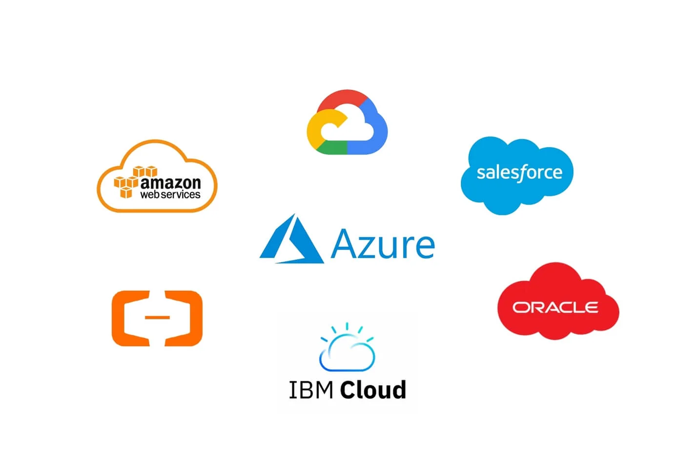

# Terraform

## ¿Qué es Terraform?
Terraform es una herramienta de infraestructura como código (IaC) que permite automatizar la creación, modificación y gestión de infraestructura en múltiples proveedores de nube y on-premise mediante archivos de configuración

## ¿Qué nos permite hacer con Terraform?
- **Infraestructura como Código (IaC)**: Permite definir y provisionar infraestructura mediante archivos de configuración.
- **Independencia de plataforma**: Terraform es compatible con una amplia gama de proveedores de servicios en la nube (AWS, Azure, Google Cloud Platform, entre otros). Además puede integrarse con proveedores de infraestructura on-premise y de software como VMware, Docker y Kubernetes.

- **Módulos reutilizables**: Permite crear y usar módulos reutilizables para organizar y gestionar componentes comunes de la infraestructura de manera eficiente.