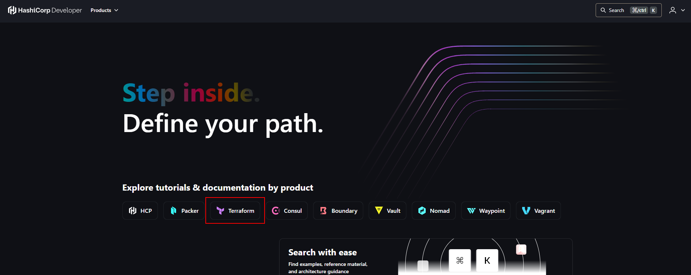

# ¿Cómo instalar Terraform?
## Instalación de Terraform en Windows
Para poder proceder con la instalación de Terraform, primero debemos de acceder a la página oficial de HashiCorp Developer: https://developer.hashicorp.com/

Luego en la página principal, debemos de seleccionar Terraform, ya que es la tecnología que deseamos instalar:

## Instalación de Terraform en Linux
